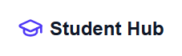
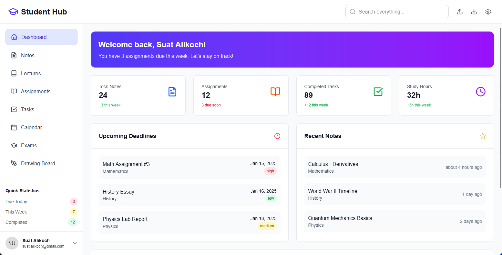
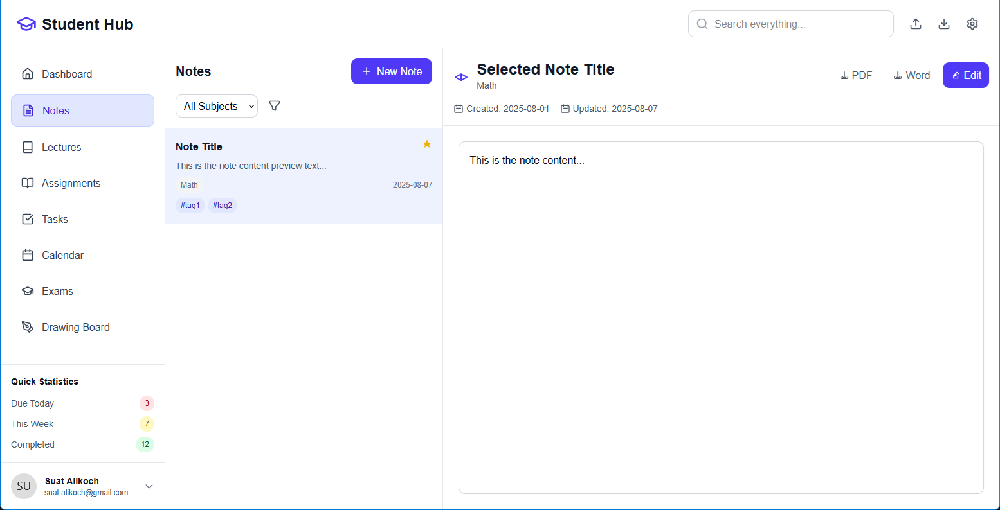
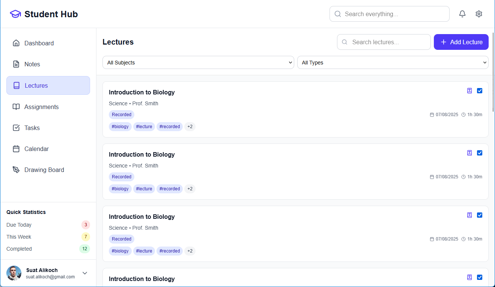
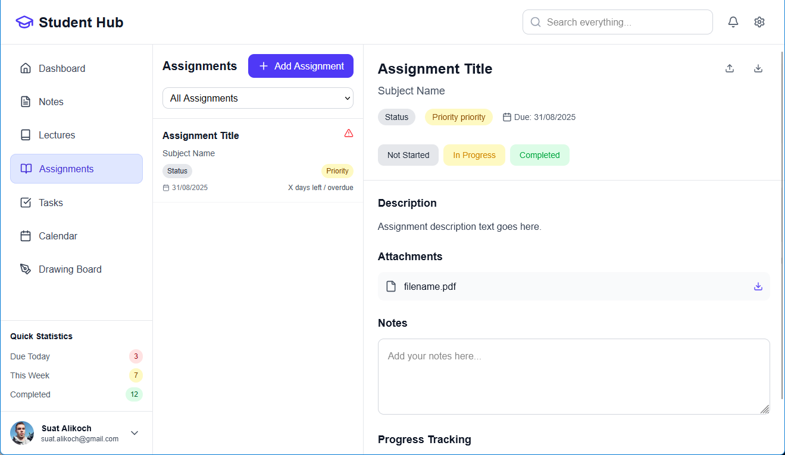
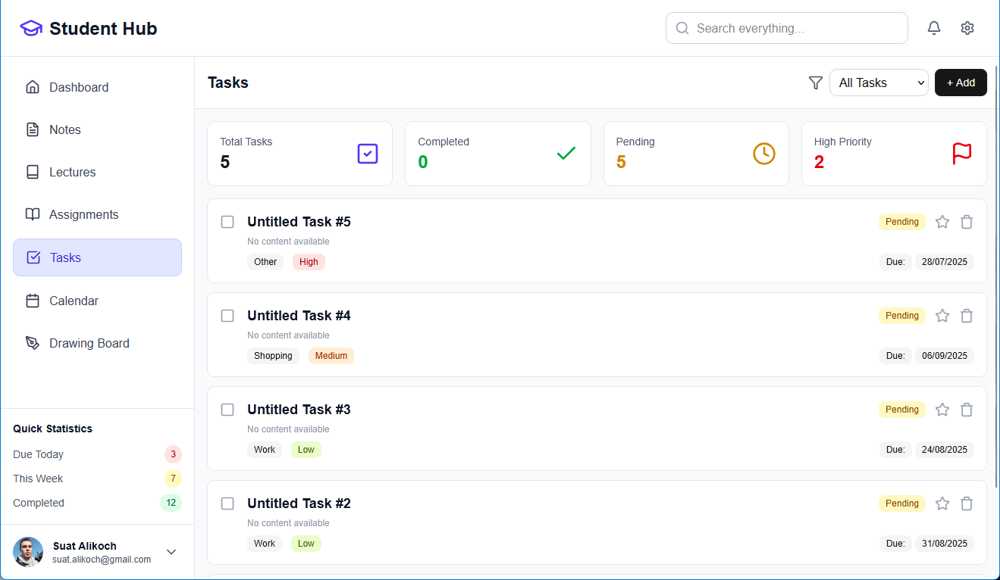
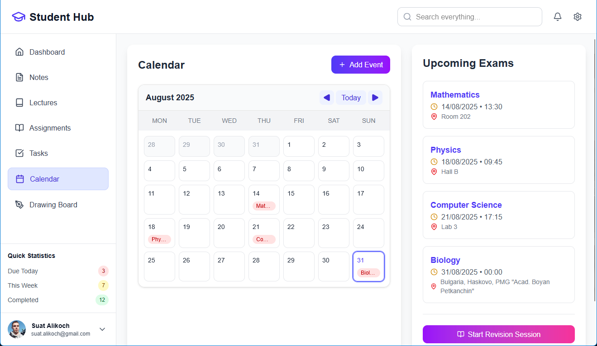

---



# 🎓 Student Hub


**Student Hub** is an all-in-one study management platform for students.  
Plan your tasks, track deadlines, organize notes, and monitor your progress — all in one simple, fast, and secure dashboard.

Built with **Next.js**, **Supabase**, and **Tailwind CSS**, it’s designed for speed, simplicity, and productivity.

---

## ✨ Features

- 🔐 **Secure Authentication** – Email/password login, registration, and password reset with Supabase Auth
- 📅 **Deadline Tracking** – Organize assignments, exams, and projects with due dates & priority levels
- 📝 **Notes Management** – Keep your study notes organized by subject
- 📊 **Progress Tracking** – Visualize your weekly study achievements
- 📱 **Responsive Design** – Works perfectly on desktop, tablet, and mobile
- 🛡 **Protected Routes** – Only authenticated users can access their dashboard & settings
- ⚡ **Fast & Modern** – Built with the latest web technologies for performance

---

## 🖼 Screenshots

| Dashboard                                                    | Notes                                        | Progress                                           |
| ------------------------------------------------------------ | -------------------------------------------- | -------------------------------------------------- |
|          |  |  |
|      |  |  |
|  |

---

## 🚀 Tech Stack

- **Frontend:** [Next.js 13+](https://nextjs.org) (App Router)
- **Backend:** [Supabase](https://supabase.com) (PostgreSQL + Auth + API)
- **UI:** [Tailwind CSS](https://tailwindcss.com) + [shadcn/ui](https://ui.shadcn.com)
- **Auth:** [Supabase Auth](https://supabase.com/docs/guides/auth)
- **Deployment:** [Vercel](https://vercel.com)

---

## 🛠 Getting Started

### 1️⃣ Prerequisites

- Node.js **v22.18.0**
- Supabase project with API keys
- `.env` file with your credentials:

```env
NEXT_PUBLIC_SUPABASE_URL=your_supabase_url
NEXT_PUBLIC_SUPABASE_ANON_KEY=your_supabase_anon_key
```

### 2️⃣ Installation

```bash
# Clone the repository
git clone https://github.com/suatalikoch/studies.git

# Go to project folder
cd studies

# Install dependencies
npm install

# Start development server
npm run dev
```

Then open: http://localhost:3000 🎯

---

# 📂 Project Structure

```bash
/app            # Next.js App Router pages & layouts
/components     # Reusable UI components
/lib/supabase   # Supabase client & API helpers
/types          # TypeScript types & interfaces
/styles         # Tailwind CSS config & global styles
```

# 🗄 Database Schema

deadlines

| Column     | Type      | Description              |
| ---------- | --------- | ------------------------ |
| id         | bigint    | Primary key              |
| user_id    | uuid      | Linked to Supabase Auth  |
| title      | text      | Task title               |
| subject    | text      | Subject category         |
| due_date   | date      | Deadline date            |
| priority   | text      | low / medium / high      |
| created_at | timestamp | Auto-generated timestamp |

notes

| Column     | Type      | Description              |
| ---------- | --------- | ------------------------ |
| id         | bigint    | Primary key              |
| user_id    | uuid      | Linked to Supabase Auth  |
| title      | text      | Task title               |
| subject    | text      | Subject category         |
| due_date   | date      | Deadline date            |
| priority   | text      | low / medium / high      |
| created_at | timestamp | Auto-generated timestamp |

progress

| Column    | Type   | Description               |
| --------- | ------ | ------------------------- |
| id        | bigint | Primary key               |
| user_id   | uuid   | Linked to Supabase Auth   |
| day       | text   | Day of the week (Mon–Sun) |
| completed | int    | Completed tasks count     |
| total     | int    | Total tasks planned       |

# 📦 Deployment

## Deploy via Vercel:

```bash
npm run build
npm start
```

Make sure environment variables are set in your hosting provider.

# 🤝 Contributing

1. Fork the repository
2. Create a feature branch:

```bash
git checkout -b feature/my-feature
```

3. Commit your changes:

```bash
git commit -m "Add new feature"
```

4. Push to your branch:

```bash
git push origin feature/my-feature
```

5. Create a Pull Request

---
